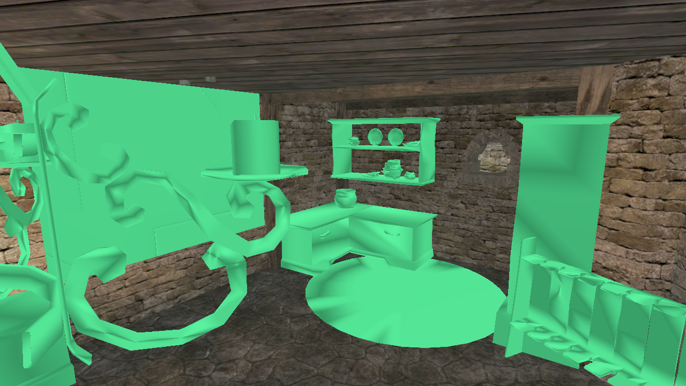
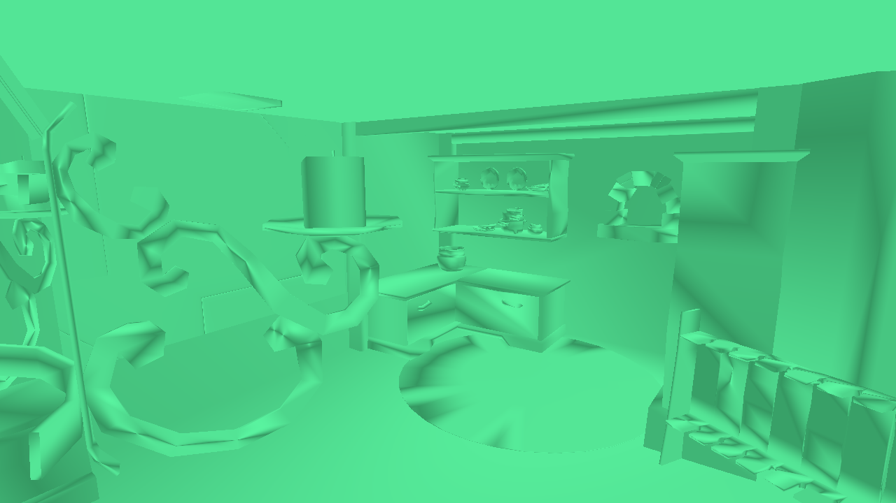

# The collision geometry

The game ships what it collides with separately from what it draws, and that
turns out to be the single most useful fact about making a player walk in it.

`_compiledPhysic.pak` holds 6735 files with the extension `.xnvmsh`, one per
object, and the mesh archive holds 782 more. A chest is 682 bytes. The median is
9691. They are far simpler than the meshes beside them: a grindstone wheel is 14
triangles in collision and 14 in the visual, but a castle is 98152 against
hundreds of thousands.

## What a file is

An ordinary Genome property set - the same container already read for
`.lrgeodat` and `.xlmp` - of class `eCResourceCollisionMesh_PS`, carrying the
object's name and a `ResourcePriority` float, wrapped around one or more cooked
NovodeX meshes. NovodeX is what PhysX was called before NVIDIA bought it, and
Gothic 3 shipped on PhysX 2.x in 2006.

Each blob:

```
+0   "NXS", a version byte, "MESH"
+16  the float 0.001, identical in every file - the cooking tolerance
+28  the vertex count
+32  the triangle count
+36  the vertices, three floats each, then the indices
```

Then an OPCODE tree, which was its acceleration structure. That is skipped: we
build our own or hand the triangles to something that does.

The index width is not written down. It is 8, 16 or 32 bits and it varies within
a single file - a flight of stairs has one part at 32 bits and its neighbours at
16. So each width is tried and the one that reads correctly is taken.

A file holds several blobs when the object was authored in pieces: a stick is
two, a flight of stairs three, most objects one.

## What is in there

| | triangle meshes | convex hulls |
|---|---|---|
| `_compiledPhysic.pak` | 3940 | 2795 |
| `_compiledMesh.pak` | 782 | 0 |

The hulls are `NXS` + `CVXM` and their names end in `_cv`: helmets, armour, the
things thrown about rather than stood on. They are not read yet, because walking
needs the triangle meshes. Nothing else is in there - the third bucket is empty,
so the reader accounts for every file.

7.15M triangles for the whole world's collision, median 184 an object. That is a
different scale from drawing it, where a single sector can place 1.4M.

The landscape has collision per cell:
`g3_myrtana_landscape_01/lod/g3_myrtana_landscape_cell_243.xnvmsh`.

## How the reading was checked

Three checks, and each one caught something the one before it could not.

**Every index inside its own vertices.** This is the obvious test and it is not
enough. Reading 16-bit indices as 8-bit leaves every second byte a zero, and a
zero is perfectly in range - so the mesh passes while half its triangles come out
as a corner repeated.

**No degenerate triangles.** This is what tells the two apart, and it is
unambiguous: a right reading has none and a wrong one has half. It caught the
index width immediately, on files where the first test had been happy.

**The bounding box against the visual mesh.** Both of the above are internal:
they check the reading against itself, so they cannot catch a reading that is
self-consistent and still not the object. The mesh archive is an independent
source, and comparing the two boxes failed completely - 0 of 1026 agreed, worst
99% off.

That failure was the most valuable result of the day. The collision is in
**metres** and everything drawn is in **centimetres**: a grindstone wheel is
0.259 across in collision and 25.9 drawn, with 14 triangles on each side and four
parts against four elements. PhysX works in SI units and the cooking kept them;
the renderer never had to care. With the factor applied, 1025 of 1026 agree and
the ratio of sizes is exactly 1 at the 10th, 50th and 90th percentile.

Without that check the player would have collided with a world a hundred times
too small, and every internal test would have said the reading was fine.

## What this means for the physics engine question

No modern engine can load this data. PhysX 3.0 broke compatibility with 2.x
cooked formats and never looked back, so PhysX 5 cannot read it either - the
option with a claim to authenticity has no advantage at all. The triangles have
to be recovered by parsing whatever engine is chosen, and once they are
recovered, feeding them to any engine is the same work.

So the decision can be deferred, and the parsing could not be.

## Looking at it

Reading a format is not the same as reading it correctly, and the checks above
are arithmetic. The overlay is the check that a person can fail: the collision
of every placed object, drawn over the world at the transform the world gives
it, in flat green. `--collision <pak>` loads it and `--collision-view N`, or the
`C` key, cycles the world alone, the world with its collision over it, and the
collision alone.



It lands where it should. The wrought-iron candelabra keeps every curl of its
frame, the candle has its own stand, the shelf has its plates, the rug is a
disc on the floor and the banner hangs flat on the wall. Nothing floats, nothing
is a hundred times out, nothing is rotated. This is the same claim the bounding
boxes make, but a wrong transform or a swapped axis would survive that check and
not this one.

Two details make it work. The collision hugs the surface it belongs to, so drawn
over the world the two fight for the same depth; the vertex shader nudges
collision towards the eye by `0.0002 * w`, which holds at every distance and
costs a push constant rather than a second pipeline. And the cooked mesh carries
no normals, so flat ones are generated per triangle - enough shading to read a
shape, and honest about being a debug view.

The collision is an ordinary batch with a flag, so it streams, culls and draws
through the machinery that already exists; hiding it is the cull rejecting whole
batches by that flag. With the archive loaded and the view off, the frame is
1.56 ms against 1.60 - the same frame, and the difference is noise.

The picture above was taken when 215 of the 435 placed objects still found no
collision, which is why the walls and the floor are missing from it. That had
two causes, and both are below.

## The convex hulls

2795 of the 6735 files are not triangle meshes at all. They are convex hulls,
and they are everything the game lets you push about: crates, sacks, stumps,
loose branches, helmets, weapons on the ground. The reader skipped them at
first, which is why the first overlay had 215 objects with nothing.

The hull chunk is stamped `ICE` rather than `NXS` - the file is a NovodeX
container holding a chunk of ICE, the geometry library PhysX 2.x was built on -
and searching for the `NXS` stamp is why they read as empty files rather than as
anything wrong. After the `CVHL` tag come a version and six counts: vertices,
triangles, edges, polygons, and the number of polygon corners written twice.
Then the vertices, three floats each; then a value naming the highest index,
which is what says whether the indices are one, two or four bytes wide; then
three indices per triangle.

Three of those counts are redundant, and that is exactly what makes them worth
reading. A convex solid satisfies Euler's formula, so vertices plus polygons has
to be edges plus two. Triangulating a polygon of n corners gives n - 2
triangles, so the corner count less twice the polygon count has to be the
triangle count. A chickenbox is 8 vertices, 12 edges, 6 polygons and 24 corners:
8 - 12 + 6 = 2, and 24 - 12 = 12 triangles. It is a box, and it reads as one.
A reading from the wrong offset does not satisfy either identity.

**One file in 6735 is older.** `g3_object_crategroup_01_cv` is version 2, which
says only how many vertices and triangles it has - no edges, no polygons, and no
value naming the index width - so both of the checks above are gone. What
replaces them is the same formula from the other side: a hull triangulated into
triangles has 2V - 4 of them, counting only the corners that are on it. That
file keeps 141 points of which 69 are corners, and declares 134 triangles, which
is 2*69 - 4 exactly. The other 72 points are interior - it is a group of crates,
and the hull over them needs only the outside. The width is found the way the
triangle meshes find theirs: try each, keep the one that reads as a solid.

With the hulls read, the reader covers the archive: **3940 triangle meshes,
2795 convex hulls, nothing that will not read**, 8643 parts and 5.36 million
triangles in all.

## Three names for the same object

The lookup was finding a fifth of what exists because it only tried one name.
An object's collision is stored under its own name, or that name with `_col`,
or that name with `_cv`, and the archive is split roughly in half between the
first two:

- `<name>.xnvmsh` and `<name>_col.xnvmsh` - triangle meshes, the things you
  stand on and walk into. Walls and floors are all in the second form, which is
  why the room had none.
- `<name>_cv.xnvmsh` - the convex hull, for things that move.
- `..._sc_1_4256` and `..._scx_0_6214_scy_1_0000_scz_1_0000` - the same shape
  cooked again with a scale baked into the name, because a cooked PhysX 2.x mesh
  cannot be scaled where it is used. We apply the world matrix, scale included,
  so the unscaled one is the one to take and these are ignored.

Trying `_col` took the test room from 220 objects with collision to 393; adding
`_cv` took it to 408 of 435.



The same room with the world hidden. Every surface a player would touch is
there - the walls, the floor, the ceiling beams, the arch of the oven - and it
is a far cheaper mesh than what is drawn over it.

## What has none, and whether that is right

The 27 that remain are not a gap. They are mushrooms, spiderweb decals,
waterfalls and the river meshes - decoration and water, which the game gives no
collision because you walk through them. Checked against the archive: there is
no `g3_object_mushroom_01` under any of the three names. The dungeon spiderwebs
that do have collision are level geometry, a different asset from the decal.

**Trees are a real gap.** They are planted through the Speedtree path rather
than as placements, so the name lookup never runs for them and nothing in the
forest collides. That is the next thing to find, and it is a different question
- a tree's collision in this engine is likely a shape in its own definition
rather than a cooked mesh in an archive.

## Trees: where the collision is not

Trees are placed as entities that name a `.spt` definition rather than a mesh,
and the geometry is grown at load time, so the name lookup above never runs for
them. Two obvious places to look for their collision turned out to be empty, and
ruling them out is worth writing down so nobody looks again.

**Not in the archives.** Searching all 6736 entries of `_compiledPhysic.pak` and
the mesh archive for the tree names - speedtree, douglasfir, longleafpine,
broadleaf, italiancypress, honeylocust - finds nine files, and none of them is a
SpeedTree: seven `g3_object_tree_mushrooms_*` and two spellings of
`g3_object_varant_tree_01`. There is no cooked collision mesh for any tree in
the game.

**Not in the definitions.** SpeedTree's own SDK lets an artist put collision
primitives on a tree, and a `.spt` stores them in token group 18000 - a marker,
a type, three vectors and a name, which is the shape of the SDK's
`SCollisionObject`. Our reader already kept every token in file order, so this
cost no new parsing. `g3sptcol` walks the archive: all 98 definitions carry
exactly one such object, and every one is empty - type 0, all three vectors
zero.

What is left is the engine deriving something at runtime.
`eCSpeedTreeCollisionDesc` derives from `eCPolyGeometryCollisionDesc` and offers
`GetLocalPolygon` / `GetWorldPolygon` / `GetIntersectionCount` over a
`SetResourceSpeedTreeEntity` - polygons produced from the SpeedTree resource
itself. That is a ray-intersection descriptor, though, and whether the physics
simulation uses the same polygons, a primitive, or nothing at all is not yet
established.
