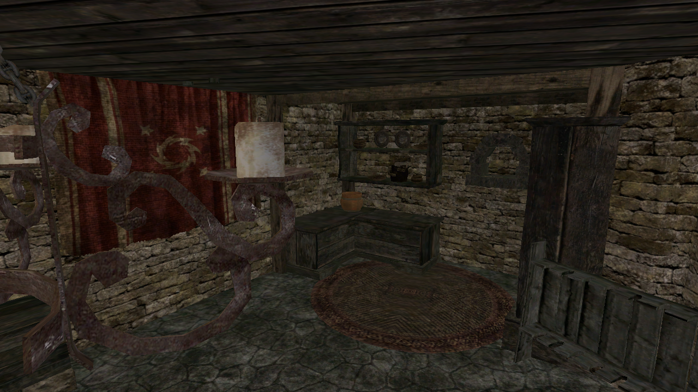
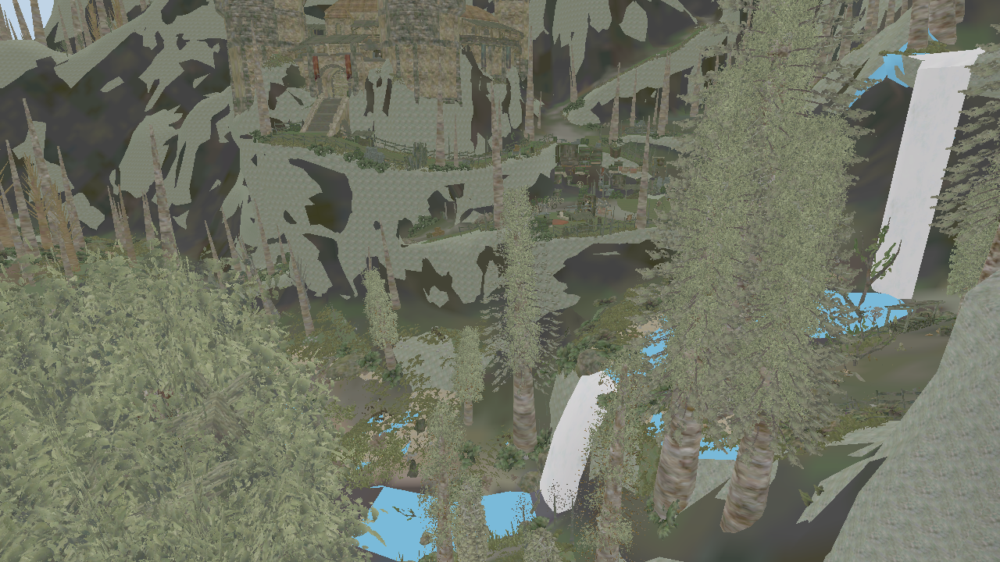

# Lighting

The world had none until now: the fragment shader multiplied the diffuse map by a
fixed directional term, and everything came out flat and dark.

## The lamps

Sectors carry `eCStaticPointLight_PS`, and nothing was reading it. A light is

    Color        bCFloatColor   four bytes of tag, then red, green and blue
    Range        float          world units - a thousand is ten metres
    CastShadows  bool
    Offset       bCVector       moves the light off the entity's origin

Across all 2177 sectors there are **588 of them**, every one casting shadows, with
ranges from 300 to 4000 units. 588 is small enough that a forward renderer is the
right shape here rather than a deferred one - and our foliage is alpha-tested,
which deferred handles worst.

Each frame the nearest sixteen are written to a uniform buffer and the shader adds
them to daylight. A light is dropped past six times its own range.

## The curve, and a correction

This note used to say the diffuse maps carry baked shading, which is why the
forests turn black when lit properly. That was wrong, and the game ships the
proof: `Materials.pak` holds the engine's own HLSL, and `ip_hdri.fx` ends every
frame with

    cOut = 1 - exp(-fExposure * cOut)
    cOut *= pow(1 - dot(centre, centre), fVignette)
    cOut = pow(cOut, fGamma)

`ge3.INI` sets `Render.HDRExposure=2.85`, `Render.HDRGamma=0.60`,
`Render.HDRVignette=0.30`. A texel of 0.15 comes out of that at **0.53**. The
darkness was in the curve we were not applying, not in the textures - whose
brightness sits inside the physical albedo band: ground 0.29, rock 0.24, foliage
0.20, bark 0.15.

Exposure and gamma are in, with the game's own constants. Mean frame brightness
over the valley went from 43.7 to 109.5.

## What the materials can and cannot support

From the same shipped shaders, over all 1150 materials:

- **No metallic and no roughness anywhere.** Not one material binds a texture to
  `SpecularPower`; shininess is a single scalar times 128, a Phong exponent.
- The surface model is albedo times Lambert, plus a normalized Phong lobe tinted
  by the **light** colour rather than the albedo, masked by the specular map.
- 334 of the 736 wired specular slots are not a map at all but
  `Multiply(diffuse, constant)` - the mask is the albedo scaled.

So a physically based layer here has to **invent** roughness rather than read it.
That is worth doing as a separate switch, after the lightmaps, so there is
something to compare against.

## Lightmaps: what is established, and what is not

`Lightmaps.pak` holds **11234 `.xlmp` files, 132 MB**, named
`<mesh>_{guid}.xlmp` - one per placed instance rather than per mesh. That is the
missing contrast: the meshes themselves cannot carry it, because they are shared
between thousands of placements.

Established by reading:

- It is a `GENOMFLE` container, the same wrapper the sectors and meshes use, and
  our own `StringTable` and `readPropertySetHeader` parse it.
- The class is `eCResourceLightmap_PS`, carrying one property, `ResourcePriority`
  (0.04 in the file examined).
- Its string table names **the mesh it belongs to**, in full:
  `/Data/_compiledMesh/G3_Objects_Myrtana_Buildings_01/G3_Architecture_Bridge_Large_01.xcmsh`.
- The body holds prefixed arrays - a one-byte prefix, a u32 count, then the data
  - and the first array's count is **307, exactly the vertex count of that
  mesh's first element**. Its entries are packed four-byte values whose top byte
  varies from 0xf5 to 0xfe: bright, as an outdoor bridge should be. The second
  array is 307 floats, the first of which is exactly 1.0.

**It is a directional lightmap, and it now reads completely: 11233 of 11233
files, nothing failing.** 20689339 lit vertices, and 517012 bitmaps across the
2815 instances that carry them.

The layout, as the engine reads it:

    u16 version (4, and it refuses less)
    eCResourceBase_PS header
    float ResourcePriority
    string  the mesh this instance lights, in full
    u32   type: 0 per vertex, 1 mixed
    float scaling
    u32   one entry per mesh element, each optional:
            u16 version
            array of u32   a colour per vertex
            array of vec3  an incident direction per vertex
            u16 bitmap count, then that many:
              marker 11223344, a version, a UV set, an offset, a size, the pixels

Two things in there are worth stating plainly.

**The colour is two quantities in one word.** The low 24 bits are the baked light
that reached the vertex; the top byte is not alpha but **ambient occlusion** -
the bake writes it as the fraction of rays that reached the sky. They come from
different passes, each preserving the other's bits. The bridge's first element
reads light 0 and sky 222: unlit and open, which is what the underside of a
bridge should be.

**The direction is a unit vector per vertex**, twelve bytes. That is what a
normal-mapped surface needs and a flat colour cannot give.

## What cost the time, and what saved it

Three readings of a single file failed at the same offset. Two mistakes were
mine and both are worth remembering.

The first was a stride: read at sixteen bytes an entry, the vector (1, 0, 0)
comes out as (0, 1.0, 0, 0), and 150 KB of perfectly good directions look like
meaningless repeating records. The pattern was real; the reading was wrong.

The second was assuming a marker ends something. `11223344` does not close the
element - it **opens each bitmap**, and reading it as a terminator is what left
those 150 KB unread and stopped the walk after the first element of three.

What broke the deadlock twice over: comparing three lightmaps of one mesh, which
showed at once which fields are per instance; and then reading the engine's own
parser, `eCResourceLightmap_PS::Read` at 0x101CBB70, found through the export
table rather than by hunting strings - Engine.dll exports 16224 decorated names,
so the function could simply be looked up.

## On the geometry

The GUID in the file name is the placing entity's own, at body+4 in its record.
That was proven before it was used: the guids from the archive's file names
appear verbatim in the sector that places them.

Instancing made the rest awkward, and the way out is worth recording. Lighting is
per instance; vertices are shared between instances; so the lighting cannot go in
the vertex buffer. It goes in a storage buffer, every instance's colours end to
end, and each instance carries where its run begins - in the first matrix row's
w, which the transform does not use. The per-frame instance buffer keeps its
shape and its cost, and the vertex shader reads `colours[base + gl_VertexIndex]`.

The directions are wired the same way, in a second buffer of three floats a
vertex.

## What a lightmap actually contains

Measured over all 11233 files and 20689339 vertices:

    mean baked light   8.9 of 255
    mean sky           190.4 of 255
    vertices with any light at all   18.3%

**These are ambient occlusion maps far more than light maps.** The occlusion byte
is the signal; the colour is a small addition present on less than a fifth of
vertices. That is why applying the occlusion changed the picture immediately -
mean brightness in the fortress room went from 34.7 to 79.4 - and why the
incident directions, wired end to end and carrying 422577 floats in that sector,
changed nothing visible: they shape a term that is zero almost everywhere.

They are kept because they are correct and because they will matter twice over:
on the 18% of vertices that do carry light, and once normal maps are read, where
a direction is the whole point.

Still not established: whether the colour is light alone or light times albedo,
and what the 517012 bitmaps hold - those are addressed by the second UV set,
which 2263 mesh elements carry and nothing yet uses.
