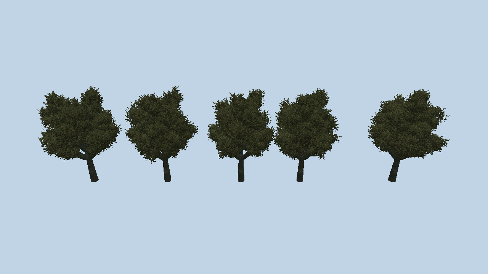
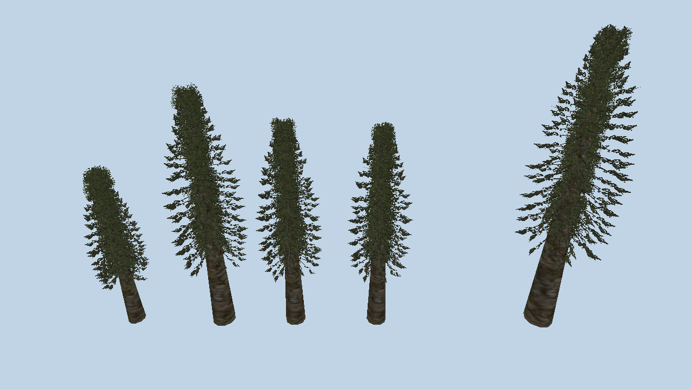
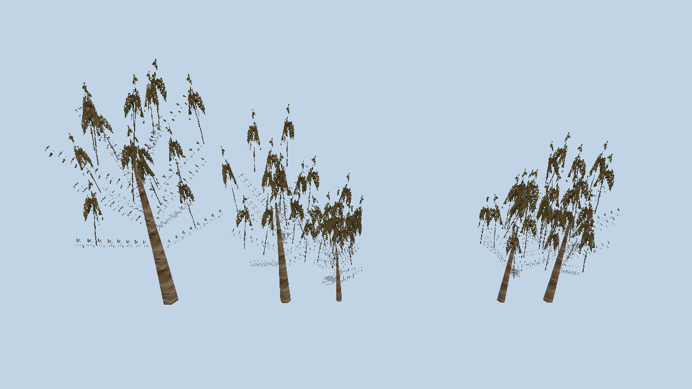
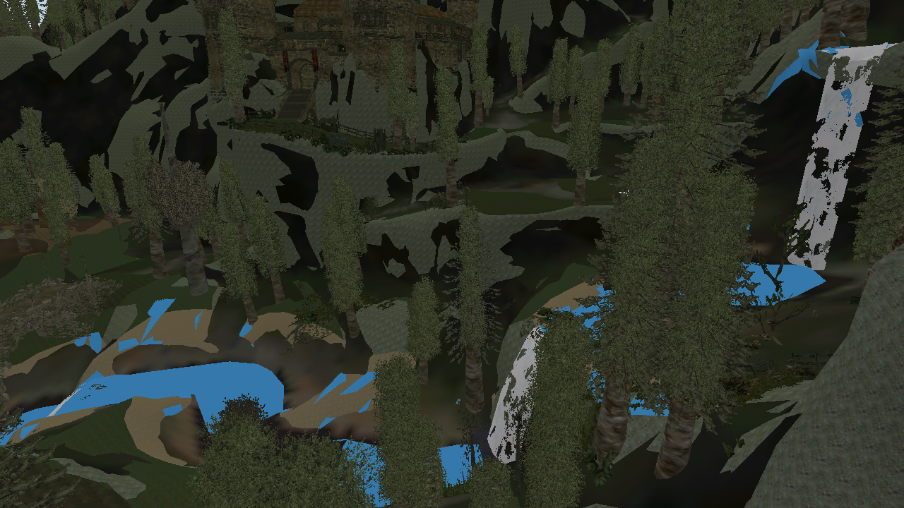

# Trees

Gothic 3 does not ship tree meshes. It ships 98 SpeedTree definitions in
`Speedtrees.pak`, 5 to 9 KB each, and grows the geometry at load time with a
library that is statically linked into `Engine.dll`. So drawing the game's
forests means reading the definitions and growing our own trees from them.

## The container

A `.spt` is a flat stream of tokens: a u32 id, then a value whose width is fixed
per id and **written nowhere in the file**. The original reader knew the widths
from a table, so the table had to be recovered.

Three things make a naive parser fail, each found by the stream refusing to land
on the last byte of the file:

- **The stream is byte-aligned, not word-aligned.** Id 2002 carries a single
  byte, after which every later u32 sits at an odd offset.
- **Some ids carry nothing at all** - they are section markers. A parser that
  makes every id consume four bytes desynchronises on the fourth token.
- **One id is a counted array.** Id 10002 is a count followed by that many
  32-byte records. It is zero in 16 of the 98 files, so it surfaced last.

The widths were therefore searched for rather than guessed, under two
constraints a wrong table cannot satisfy: every file must end exactly on its
last byte, and one table must serve all 98. An empty string and a zero-length
array read exactly like a plain word, so where both fit, the file that carries a
non-empty value settles it.

The result is 149 ids, in `runtime/src/genome/spt.cpp`. `g3tree` parses 98 of 98
with nothing left over - 373 branch levels and 127 leaf kinds in all.

    g3tree "…/Data/Speedtrees.pak"
    g3tree "…/Data/Speedtrees.pak" myrtana/g3_tree_m_redoak_01.spt

## What a definition holds

    2000-2007   bark texture, size (2006) and its variance (2007), a seed
    3000-3010   the trunk
    4000-4007   leaves: a texture name, card size, and the atlas tile
    6000-6017   one block per level, repeated: nine curves and seven numbers
    8003/5/9    materials, 52 bytes each - four RGB colours and a shininess
    14000-14008 fronds, for conifers and palms
    20002       the composite atlas

Id 1014 says how many levels the file carries - 3, 4 or 5, counting the trunk
and the leaf level - and it equals the number of 6000 blocks exactly, in all 98
files. So the count is stated as well as implied, which is worth knowing before
trusting a repeat count.

Id 18005 is **empty in 97 of the 98 files**. The one that carries a value names
`CompositeShadowMap.tga`, which resolves to nothing in the archives; an earlier
note here quoted that string as though it were the field's content, which is the
mistake of reading one sample as a rule.

Id 2001 looks like a height - a red oak carries 1100 - but it is identical for
the XS and the S variant of a species, so it cannot be the size. **Id 2006 is**:
it reads 5, 10, 20, 30 for the xs, s, m and l variants, tracking the size prefix
in the file name exactly, and a direct diff of `m_douglasfir_01` against
`l_douglasfir_01` shows 2006 and 2007 as the only size-like difference between
them.

Two of the per-level numbers are integers, not floats. Read as floats, a count
of 8 becomes 1.1e-44, which rounds to nothing - and a trunk with no segments and
three sides is a spike. That mistake is what the first three attempts drew.

## The curves

Nine Bezier curves per branch level, stored as text:

    BezierSpline 0	1	20
    {
        3
        0 -0.0142406 0.998724 0.0505106 0.177839
        …
    }

A control point is five numbers, and the middle two are a **unit vector** - true
to six decimal places on all 3913 points in the corpus - so it is a tangent
direction with its length, and the curve is a Hermite. The three numbers in the
header are the range the normalised curve is drawn across, plus a variance,
which is how one definition grows a wood rather than a row of identical trees.

## Growing one

    g3world "…/Data/_compiledMesh.pak" none         --tree "…/Data/Speedtrees.pak" myrtana/g3_tree_m_redoak_01.spt --shot oak.ppm

The trunk is a tube of rings; children hang off it between the rings rather than
on them, spaced along the parent, with the length and angle curves read at the
height each child attaches. Leaves are crossed cards. The five oaks above come
from one definition and five seeds.

The leaf texture a definition names - `RedOakLeaves_RT_1.tga` - does not exist in
the archives, and neither does any of the other 40 leaf names or 31 frond names:
the whole `speedtree/` folder in `_compiledImage.pak` is 53 files, of which 24
are bark diffuse, 23 bark normal and 6 composites. Those names are authoring
paths, not runtime references. Leaves are tiles of a shared composite atlas, and
ids 10002 to 10004 carry the four (u, v) corners of the tile each kind uses.

The material the game actually draws them with is named after the atlas:
`g3_speedtree_misc_composite_01_diffuse_01_leafs.xshmat` and `..._fronds.xshmat`
are in `_compiledMaterial.pak`, and they are `eCShaderLeaf` with subsurface
scattering enabled - which is what the `Render.LeafSubsurface` settings in
`ge3.INI` drive. We sample the atlas image directly for now and do not use that
shader.

The atlas also holds rendered billboards of every tree, which is a free
reference for what the shapes should look like.

Leaf card size has an algebraic tie rather than a guessed one: **4006 = 4005 x
2006**, exact in 242 of 254 components across the corpus. The dozen exceptions
are three files whose size was edited afterwards and whose 4006 was left stale -
`amurcork_02` is a copy of `amurcork_01` with the size changed from 20 to 15 and
the leaf size still reading 2.2. So 4005 is the leaf size as a fraction of the
tree, and 4006 the same in the tree's own units.

Two constants are not in the definitions and come from those billboards: a
trunk is bare for its lower third, and a child spans at most 0.45 of its parent.

## Fronds

Conifers first came out as bare cones, and correctly so: their needles are not
leaf cards but **fronds** - flat blades that run along a branch. Every one of the
98 definitions names a frond texture in the 14000 band, and like the leaf
textures none of those names exist in the archives: a frond is another tile of
the composite atlas. The tiles are handed out in file order, one per leaf kind
and then one for the frond.

So the last branch level of a definition that has a frond tile is drawn as
blades rather than as a tube: one quad per segment, each mapped to the whole
tile, and `14007` of them crossed about the branch axis so the spray reads from
any direction.

A palm is the honest test of that, because it is almost nothing but fronds on a
bare trunk.

## Planted

    g3world "…/Data/_compiledMesh.pak" g3_world_lowpoly_landscape_01/         --sectors "…/Data/Projects_compiled.pak" _cstat.node         --tree "…/Data/Speedtrees.pak"

A sector places a tree with an `eCSpeedTree_PS` record, which is thinner than
expected: a path to the definition, a wind flag, an ambient-occlusion flag, and
an ambient environment. No seed and no scale - the runtime applies the
definition's own size variance per instance, which is why two entities sharing
one definition have bounds of different heights.

Growing a mesh per instance is not on: 57315 trees at seven thousand triangles
each is 400 million. So each definition is grown a few times with different
seeds and those meshes are instanced, which is what the game did too - its
renderer batched every tree of a species out of one buffer. Three variants per
definition gives **57315 trees from 268 grown meshes**, and the whole map then
loads 1222158 instances of 9.6M triangles. The sector's own bounds decide
visibility, so the existing frustum, size and occlusion tests apply unchanged.

## What is not done

Outstanding: wind (the game animates it in the vertex shader, driven by
matrix arrays the SDK computes), billboards at distance, and the level of detail
the definitions carry in the 9000 band.
