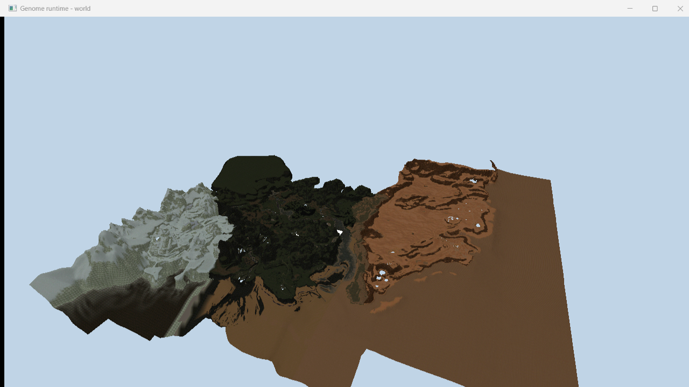
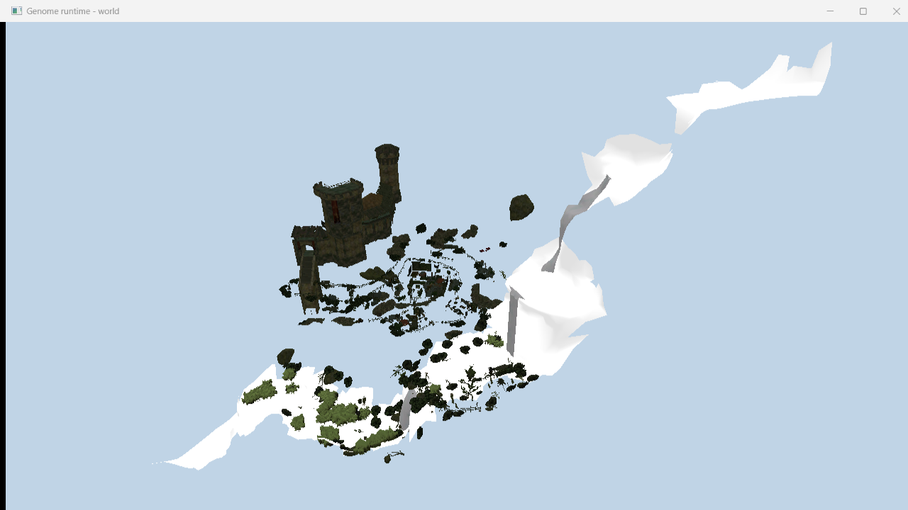
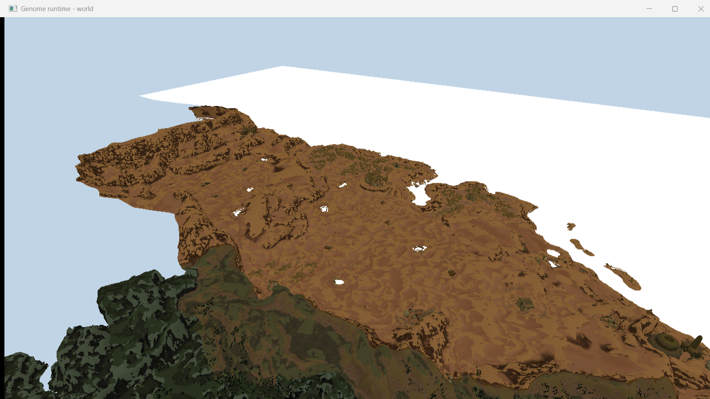
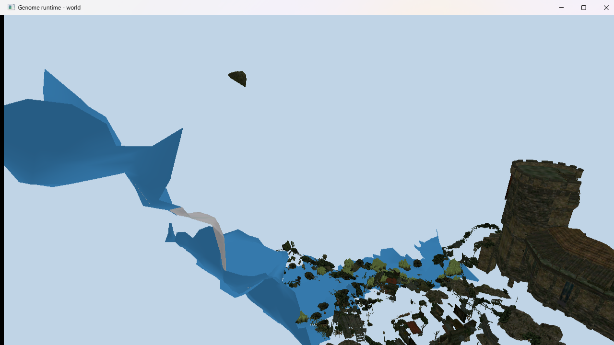
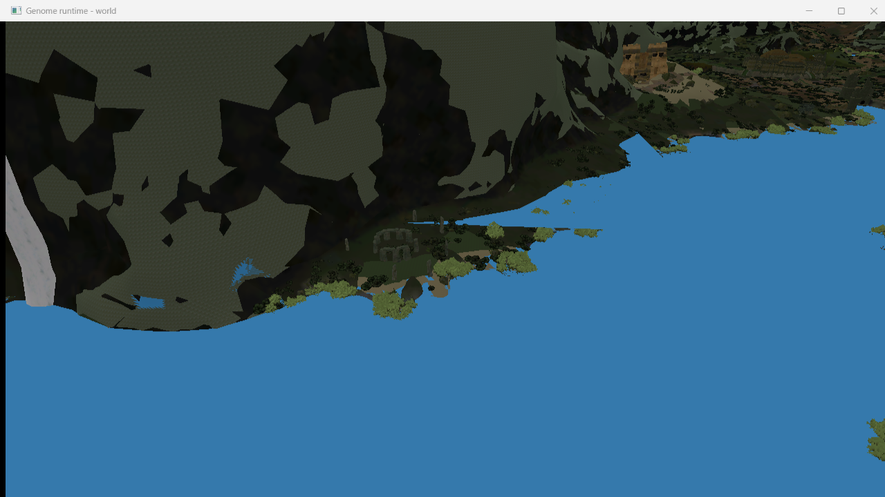

# The world, as far as we have looked

Established with our own archive reader against `Projects_compiled.pak`
(8102 entries: 1376 `.node`, 88 `.lrentdat`, plus per-layer `.sec`/`.secdat`).

## A grid, spelled out in the file names

Sectors are named by their position:

    g3_world_01_x55000y0z55000_cstat.node

- **2177 sectors**, a grid of **62 x 60** cells
- **step 10000 units**, which is exactly the `Render.PrefetchGridCellSize`
  default in `ge3.ini` - the streaming setting and the file layout agree
- extent **6.8 x 6.4 km** at one unit per centimetre, so the fan estimates of
  30-60 km2 are closer to the truth than the 75 km2 the publisher advertised

## Content is split by region and purpose

Top level is `myrtana`, `varant`, `nordmar`, plus `world`, `maps`,
`start_points` and a `sysdyn_{guid}` layer holding the biggest entity file
(80 MB). Inside each region the layers are named for what they carry:
`..._landscape_vegetation_01`, `..._dynamic_objects_03`, `..._landscape_birds_01`,
`..._navzones_01`. Navigation is one 18 MB `navigationmap.xnav`.

`g3_world_lowpoly_01_levelmesh_01` is a single low-poly mesh of the whole level -
the distant backdrop the engine draws past the normal far plane. Being one file
that covers everything, it is the obvious first thing for our runtime to render.

## The landscape draws already

The low-poly landscape turned out to need no placement data at all: those tiles
are ordinary `.xcmsh` meshes whose vertices are already in world space, tiled on
a 30000-unit grid that lines up with the sector names. So the whole map is just
349 meshes loaded and concatenated - 397k vertices, 389k triangles, spanning
4.9 x 5.0 km. Each tile names a regional material, and those resolve to just **17 distinct
textures** for the whole map - Myrtana, Varant and Nordmar in a few variants
each - so they are uploaded once and shared, and the map draws as a handful of
texture binds rather than one per tile. The diffuse maps already carry baked
shading, which is why the lighting here stays gentle: at the strength a
character wants, the forests turn black.

    g3world "…/Gothic 3/Data/_compiledMesh.pak"

## Static objects

Static content is not in `.lrentdat` - that holds NPCs and dynamic props. It is
in the per-sector `_cstat.node` files, 2177 of them, 347 MB in all. Both file
kinds share the container we already read and the same entity record; only the
header differs.

Every one of the 2177 parses: **169091 entities, 105879 placing a static mesh**,
and the positions land inside the cell their file name announces.

An entity is a fixed 298-byte body preceded by an 89-byte spatial prologue. What
matters for rendering sits at three offsets: the name at +41, a full 4x4 world
matrix at +43 (row-major, row-vector, translation in the fourth row, absolute -
no parent to resolve), and the property-set count at +294. The mesh comes from
the `eCVisualMeshStatic_PS` set, property `ResourceFileName`.

Two things cost time and are worth stating plainly:

- Each property-set record is closed by a `DEC0ADDE` marker **after** its
  declared end. Skipping to the declared end alone lands the next read inside
  the tail of the current record, and the class name then resolves to something
  plausible-looking - a mesh name - rather than failing outright.
- The first two entities of a sector are bookkeeping (`Root`) with no property
  sets at all, so a parser that assumes every entity carries a visual gives up
  immediately.

## It draws

    g3world "…/Data/_compiledMesh.pak" none --sectors "…/Data/Projects_compiled.pak" x55000y0z55000_cstat.node

One sector, 1344 objects placed from 1361 references: a keep with its gate and
battlements, a red banner, and the shrubs, trees and rocks around it. Nine mesh
names do not resolve in `_compiledMesh.pak` and are skipped.

## The whole world at once

    g3world "…/Data/_compiledMesh.pak" g3_world_lowpoly_landscape_01/             --sectors "…/Data/Projects_compiled.pak" _cstat.node

All 2177 sectors together: **104884 objects drawn from 4079 distinct meshes**,
8.8M unique vertices, 6.0M triangles, 7282 draws, spanning 6.9 x 6.5 km - the
size the sector grid predicted.

Instancing is what makes that possible. A mesh is stored once and repeated
through a per-instance world matrix on its own vertex binding; indices stay
local to their mesh and `vertexOffset` rebases them at draw time. Placing the
same objects by transforming vertices on the CPU cost four times the memory for
a single sector and would not have scaled to the map.

The white patches turned out to be **water**. Its material uses a dedicated
shader with no diffuse slot at all, so there was nothing to resolve and the
fallback took over - rivers and lakes rendered as white sheets. Naming the
failures rather than counting them is what made that obvious in one run: every
unresolved element was `G3_Myrtana_Water_River_01_A` or a river depth mesh. With
a blue stand-in the sector reports zero untextured elements.

The viewer flies: hold the right mouse button to look, WASD to move, Q and E to
drop and rise, Shift to sprint and Ctrl to creep. Speed scales with the loaded
extent, so the same controls suit one hut and the whole map, and the camera
starts aimed at whatever was loaded instead of at a fixed heading.

## Only drawing what is in front of you

Every placement carries world-space bounds the engine already computed, sitting
at offset +219 in the entity body - so visibility testing needs no work at load
time, only reading a field we were skipping. Each frame the instance buffer is
rebuilt from the boxes that survive the six frustum planes.

Flying over the coast that leaves **12749 of 105233 instances** drawn: seven
eighths of the world is behind the camera or off to the sides at any moment.

The remaining waste is different in kind and needs different answers: cutlery
inside houses five kilometres away still passes the frustum test, which is what
LOD and occlusion are for. The game ships LOD chains as .xlmsh files that we do
not read yet.

## Not yet established

Whether the terrain proper is meshes or a height field, what `.lrgeodat` holds,
and how vegetation (`eCVegetation_PS`, `eCSpeedTree_PS`) and lights are placed.
