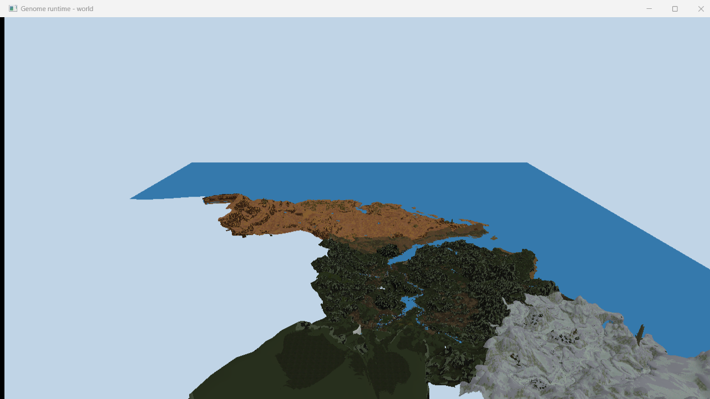
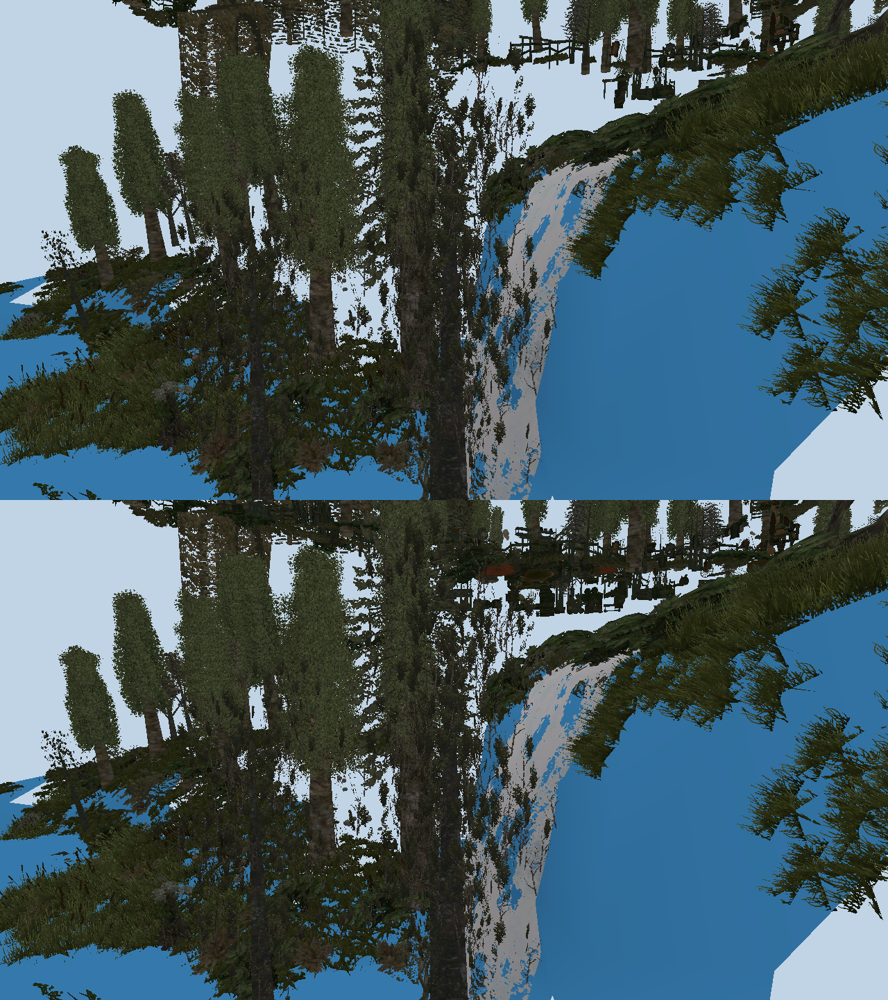
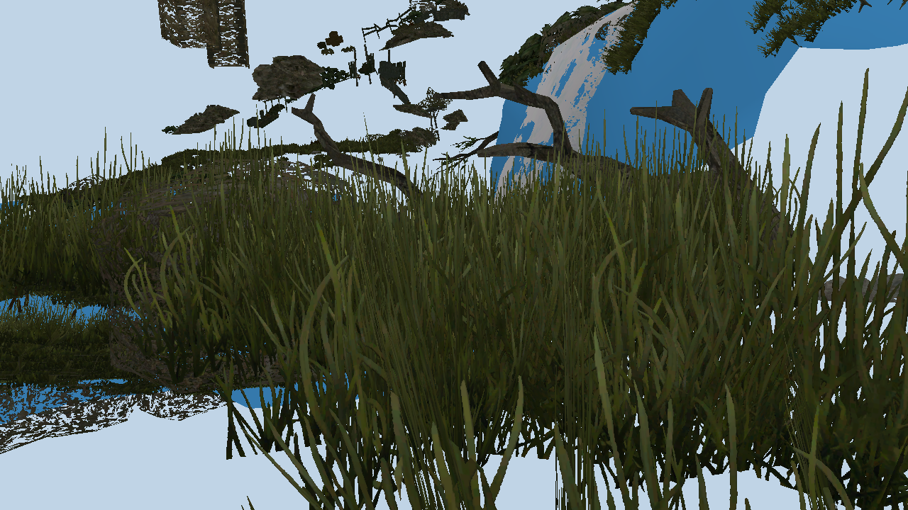

# The world, as far as we have looked

Established with our own archive reader against `Projects_compiled.pak`
(8102 entries: 1376 `.node`, 88 `.lrentdat`, plus per-layer `.sec`/`.secdat`).

## A grid, spelled out in the file names

Sectors are named by their position:

    g3_world_01_x55000y0z55000_cstat.node

- **2177 sectors**, a grid of **62 x 60** cells
- **step 10000 units**, which is exactly the `Render.PrefetchGridCellSize`
  default in `ge3.ini` - the streaming setting and the file layout agree
- extent **6.8 x 6.4 km** at one unit per centimetre, so the fan estimates of
  30-60 km2 are closer to the truth than the 75 km2 the publisher advertised

## Content is split by region and purpose

Top level is `myrtana`, `varant`, `nordmar`, plus `world`, `maps`,
`start_points` and a `sysdyn_{guid}` layer holding the biggest entity file
(80 MB). Inside each region the layers are named for what they carry:
`..._landscape_vegetation_01`, `..._dynamic_objects_03`, `..._landscape_birds_01`,
`..._navzones_01`. Navigation is one 18 MB `navigationmap.xnav`.

`g3_world_lowpoly_01_levelmesh_01` is a single low-poly mesh of the whole level -
the distant backdrop the engine draws past the normal far plane. Being one file
that covers everything, it is the obvious first thing for our runtime to render.

## The landscape draws already


The low-poly landscape turned out to need no placement data at all: those tiles
are ordinary `.xcmsh` meshes whose vertices are already in world space, tiled on
a 30000-unit grid that lines up with the sector names. So the whole map is just
349 meshes loaded and concatenated - 397k vertices, 389k triangles, spanning
4.9 x 5.0 km. Each tile names a regional material, and those resolve to just **17 distinct
textures** for the whole map - Myrtana, Varant and Nordmar in a few variants
each - so they are uploaded once and shared, and the map draws as a handful of
texture binds rather than one per tile. The diffuse maps already carry baked
shading, which is why the lighting here stays gentle: at the strength a
character wants, the forests turn black.

    g3world "…/Gothic 3/Data/_compiledMesh.pak"

## Static objects

Static content is not in `.lrentdat` - that holds NPCs and dynamic props. It is
in the per-sector `_cstat.node` files, 2177 of them, 347 MB in all. Both file
kinds share the container we already read and the same entity record; only the
header differs.

Every one of the 2177 parses: **169091 entities, 105879 placing a static mesh**,
and the positions land inside the cell their file name announces.

An entity is a fixed 298-byte body preceded by an 89-byte spatial prologue. What
matters for rendering sits at three offsets: the name at +41, a full 4x4 world
matrix at +43 (row-major, row-vector, translation in the fourth row, absolute -
no parent to resolve), and the property-set count at +294. The mesh comes from
the `eCVisualMeshStatic_PS` set, property `ResourceFileName`.

Two things cost time and are worth stating plainly:

- Each property-set record is closed by a `DEC0ADDE` marker **after** its
  declared end. Skipping to the declared end alone lands the next read inside
  the tail of the current record, and the class name then resolves to something
  plausible-looking - a mesh name - rather than failing outright.
- The first two entities of a sector are bookkeeping (`Root`) with no property
  sets at all, so a parser that assumes every entity carries a visual gives up
  immediately.

## It draws


    g3world "…/Data/_compiledMesh.pak" none --sectors "…/Data/Projects_compiled.pak" x55000y0z55000_cstat.node

One sector, 1344 objects placed from 1361 references: a keep with its gate and
battlements, a red banner, and the shrubs, trees and rocks around it. Nine mesh
names do not resolve in `_compiledMesh.pak` and are skipped.

## The whole world at once


    g3world "…/Data/_compiledMesh.pak" g3_world_lowpoly_landscape_01/             --sectors "…/Data/Projects_compiled.pak" _cstat.node

All 2177 sectors together: **104884 objects drawn from 4079 distinct meshes**,
8.8M unique vertices, 6.0M triangles, 7282 draws, spanning 6.9 x 6.5 km - the
size the sector grid predicted.

Instancing is what makes that possible. A mesh is stored once and repeated
through a per-instance world matrix on its own vertex binding; indices stay
local to their mesh and `vertexOffset` rebases them at draw time. Placing the
same objects by transforming vertices on the CPU cost four times the memory for
a single sector and would not have scaled to the map.

The white patches turned out to be **water**. Its material uses a dedicated
shader with no diffuse slot at all, so there was nothing to resolve and the
fallback took over - rivers and lakes rendered as white sheets. Naming the
failures rather than counting them is what made that obvious in one run: every
unresolved element was `G3_Myrtana_Water_River_01_A` or a river depth mesh. With
a blue stand-in the sector reports zero untextured elements.


The viewer flies: hold the right mouse button to look, WASD to move, Q and E to
drop and rise, Shift to sprint and Ctrl to creep. Speed scales with the loaded
extent, so the same controls suit one hut and the whole map, and the camera
starts aimed at whatever was loaded instead of at a fixed heading.

## Only drawing what is in front of you


Every placement carries world-space bounds the engine already computed, sitting
at offset +219 in the entity body - so visibility testing needs no work at load
time, only reading a field we were skipping. Each frame the instance buffer is
rebuilt from the boxes that survive the six frustum planes.

Flying over the coast that leaves **12749 of 105233 instances** drawn: seven
eighths of the world is behind the camera or off to the sides at any moment.

## Dropping what covers no pixels



.xlmsh LOD chains exist but are a footnote: 109 files, all houses, and they store
no switch distances at all - just an ordered list of meshes. The useful lever is
size on screen. Each entity carries its own bounds, so the angle it subtends is
radius over distance, and that times the focal length in pixels says how big it
lands. Below about a pixel and a half it is dropped.

Overlooking the map that takes the frame from 12749 instances to **6204 of
105233**, with 98915 dropped as too small - because most of the world is cutlery,
bowls and pebbles inside houses, and from a hilltop none of them cover a pixel.

Each entity also carries `VisualLoDFactor` and `ObjectCullFactor`, the engine's
own per-object hints, which are read but not yet used to bias the threshold.

## Seeing through walls, and stopping

Frustum and size tests cannot tell that a chest is inside a house: it is in
front of the camera and big enough to matter. So the few objects that actually
hide things - anything spanning more than ten metres, which is houses, cliffs
and landscape - are rasterised into a 256x144 depth buffer on the CPU, and the
rest are tested against it.

The conservatism runs in both directions, which is what keeps visible things
from vanishing. An occluder is written at the FAR face of its box, so a loose
box never claims to hide more than its object does; a candidate is tested at its
NEAR face, so anything uncertain is drawn.

Inside the fortress sector that removes 181 of 1344 objects, and the frame
differs from the unoccluded one by 164 pixels out of 230400 - not zero, so the
box approximation does occasionally reject something it should not. Across the
whole map it removes 1231 instances; less, because from a hilltop the size test
has already taken most of what walls would have hidden.

Press O to toggle it and compare.

### A tree is not a wall



Planting the trees broke this, and the numbers say why. The occluder rule was
"anything spanning more than ten metres", which a tree passes easily - and a
tree's bounding box is mostly air. In the fortress sector that made **43 of the
61 occluders trees**, and the depth buffer they wrote hid 1424 of 4049 instances
where the honest answer is 244. Whole rows of objects vanished behind trunks
they were nowhere near, which is the top half of the picture.

So foliage is now drawn but never rasterised as an occluder: a bounding box is a
fair stand-in for a house and a poor one for a tree. Grass is marked the same
way. That leaves 18 occluders in the sector, and 3.7 per cent of the frame comes
back.

## Grass is scattered, not placed



    g3world "…/Data/_compiledMesh.pak" none         --sectors "…/Data/Projects_compiled.pak" x55000y0z55000_cstat.node         --camera 53000 4050 49900 34 -10 --shot grass.ppm

Vegetation is the one thing in a sector that carries its own geometry, and it
took a wrong turn to understand why that does not mean what it looks like.
`eCVegetation_PS` holds a handful of `eCVegetation_Mesh` records - one per plant
kind, a single clump of blades in local space, with its own diffuse texture -
and then a **grid** that scatters them. Reading only the meshes and drawing each
at its entity puts 59 clumps at the origin, because the placing entity has an
identity matrix: the position of a plant is in the grid, not in the entity.

The grid is a flat list of nodes over a 1000-unit cell, each holding entries of
44 bytes: mesh id (type and index, two shorts), world position, a quaternion,
separate width and height scales, and a packed colour. So a plant is placed the
same way a static object is, and the same instancing draws it - one batch per
plant kind, one transform per plant, with bounds so it takes part in culling.

Two numbers say the layout was read correctly rather than plausibly: the grid
ends exactly on the record's declared end, and the box that follows it equals
the world bounds the entity already carries.

Across the map that is **1059610 plants from 48511 plant meshes** - the whole
world now loads 1164843 instances. Grass earns its keep from the size test: from
an overview only 5782 instances survive, with 1158525 dropped as too small.

The blades are alpha-tested rather than blended, which is what the crossed-quad
textures want; sorting for real transparency is not needed and would cost more
than it buys here.

## What a frame actually costs

Every frame time in this document up to here was the monitor. The swapchain is
FIFO with two images, so the loop blocks until the display is ready and the
number that comes out is the refresh interval: 16.68 ms on a 60 Hz panel, 10.00
on a 100 Hz one. The partition makes it plain - the time sits in
`vkWaitForFences` inside `beginFrame`, waiting for the frame two back, and
nothing this program computes is in it at all.

`--uncapped` asks for an immediate present mode and three images, and every
benched run now prints which mode it got. With the display out of the way, the
dense fortress view - 68061 instances, 925 draws, 1.84M triangles:

```
frame    2.14 ms
  cull   1.95      of which 1.9 is the per-instance walk
  record 0.10
  present 0.30
  fence  0.00      the card is never waited for
```

So the frame is the cull, and the cull is one loop over instances. That is where
any work on speed goes, and it is processor work rather than anything the card
does.

## Occlusion culling does not pay for itself

Rasterising the big occluders into a small depth buffer and asking each
surviving instance whether it is behind them rejects 4365 instances and 0.54M
triangles in that view. It costs 1.24 ms of the 1.95 ms cull. Measured three
times over, back to back:

|              | with  | without |
|--------------|-------|---------|
| frame        | 2.14 ms | **1.09 ms** |
| cull         | 1.95 ms | **0.71 ms** |
| triangles    | 1.84M | 2.38M |
| instances    | 10365 | 14730 |

The picture is byte for byte identical either way, so the test was rejecting
only things that really were hidden - it works, it is simply not worth its
price. The card never being waited for is the whole argument: 0.54M triangles it
absorbs for free are not worth 1.24 ms of processor.

It is off by default now and `--occlusion` turns it back on. The condition for
turning it on again is written into the code beside the switch: when the frame
starts waiting on the fence, which means higher resolution, heavier shading, or
ray tracing.

`--occlusion-pixels N` skips the test for instances smaller than N pixels on
screen, which was the first thing tried. It does reduce the cost - the cull goes
1.97 to 1.25 ms at 24 pixels - but it removes almost all the rejections with it,
because nearly everything occlusion rejects is small. That is the measurement
that turned "make the test cheaper" into "do not run the test".

## Comparing two versions

Two runs of identical code, twenty minutes apart, read 0.91 ms and 1.05 ms a
frame. That drift is larger than most changes worth making, so a comparison
taken as "measure A, change the code, measure B" measures the afternoon.

Alternate instead: A, B, A, B, back to back, and compare medians. The median
matters because the mean is polluted by the occasional quarter-second frame the
machine produces, which has been chased and is not ours.

One result that came out of not doing this. Of 68061 instances the size test
rejects 33478, and it is a squared distance against a squared radius where the
frustum test is six planes - so asking the cheap one first looked obviously
right. Measured, the cull did not move at all: 0.66, 0.67, 0.70 ms against 0.67,
0.66, 0.65. The frame looked worse, but that was the drift above, not the
change.

The reason it does not help is worth keeping: the frustum test is first because
it rejects more, not because it is cheaper. Asking the size test first asks it of
everything, including all the instances behind the camera the frustum would have
thrown away for the same price. Reverted - it changes what the counters mean for
no measured gain.

## Not yet established

Whether the terrain proper is meshes or a height field, what `.lrgeodat` holds,
how lights are placed, and what `eCSpeedTree_PS` refers to - it names a `.spt`
resource and nothing else, so the trees it stands for are generated at runtime
by a library we do not have.
