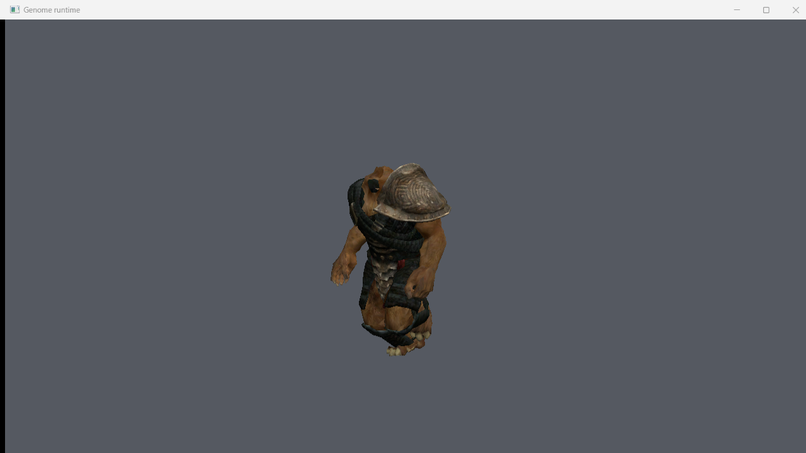
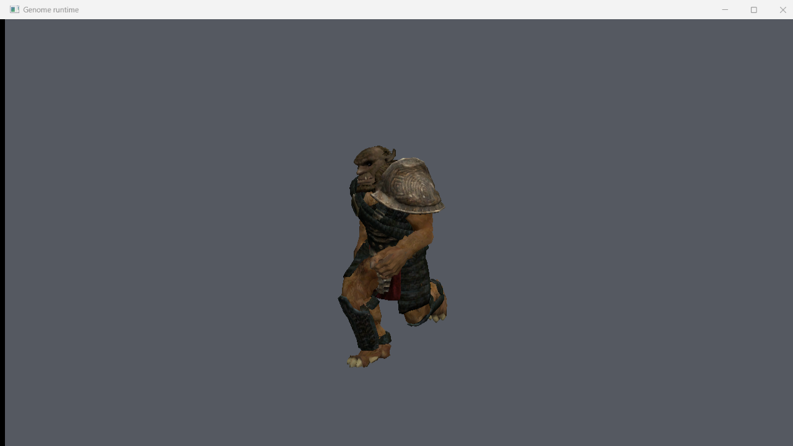

# Genome runtime

Our own 64-bit renderer for Gothic 3 assets. It does not touch the game process:
it reads the archives directly, so it is free of the original engine's 32-bit
address space, DirectX 9 pipeline and single-threaded tick.

It reads the archives, the compiled static meshes, the animated actors and their
motions, skins a character and draws it in a Vulkan window.

## Build

    cmake -S runtime -B runtime/build -G Ninja -DCMAKE_BUILD_TYPE=Release
    cmake --build runtime/build

## Try it

    g3pak  list    "…/Gothic 3/Data/_compiledMesh.pak" orc
    g3pak  extract "…/Gothic 3/Data/_compiledAnimation.pak" g3_orc_body_warrior.xact orc.xact
    g3mesh "…/Gothic 3/Data/_compiledMesh.pak" g3_weapon_orc_sword_01.xcmsh
    g3mesh  "…/Gothic 3/Data/_compiledMesh.pak"      # parse every mesh, the real test
    g3actor "…/Gothic 3/Data/_compiledAnimation.pak" G3_Orc_Body_Warrior.xact
    g3actor "…/Gothic 3/Data/_compiledAnimation.pak" # parse every actor
    g3anim  "…/Gothic 3/Data/_compiledAnimation.pak" G3_Orc_Body_Warrior.xact             "Orc_Stand_None_Fist_P0_Move_Run_N_Fwd_00_%_00_P0_400.xmot"
    g3view  "…/Gothic 3/Data/_compiledAnimation.pak" G3_Orc_Body_Warrior.xact             "Orc_Stand_None_Fist_P0_Move_Run_N_Fwd_00_%_00_P0_400.xmot"             --data "…/Gothic 3/Data" --switch 2

## What the data looks like

| archive | entries | holds |
| --- | --- | --- |
| `_compiledMesh.pak` | 6292 | `.xcmsh` static meshes, including `_col` collision variants |
| `_compiledAnimation.pak` | 6324 | 387 `.xact` actors (skeleton + skinned mesh) and `.xmot` motions |
| `_compiledImage.pak` | — | `.ximg` textures |
| `_compiledMaterial.pak` | — | `.xshmat` materials |

Motion file names encode the whole state machine, which is a free description of
the animation graph:

    wolf_stand_none_none_p0_warn_begin_n_fwd_00_%_00_p0_0.xmot
    <actor>_<pose>_<weapon>_…_<phase>_<direction>…

An orc has one actor per rank (`g3_orc_body_warrior.xact`, `_elite`, `_boss`,
`_scout`, `_shaman`) and 942 motion files match `orc_`.

## Archive format

48-byte header, then a depth-first file table: each entry carries three
filetimes, an attribute word (`0x10` marks a directory), and for files a 64-bit
offset/stored-size/size triple plus zlib flags. Names are length-prefixed with a
trailing terminator that the length does not count.

`.p00`/`.p01` volumes are overlays patching the base archive in order, so a
Community Patch file wins over the original; a zero-sized overlay entry is a
deletion. The reader applies them at load time, which is why the mesh archive
reports 6292 usable entries out of 6300.

## Mesh loading

`g3mesh` with no name parses the whole archive: **5402 meshes, none failing**,
11.2M vertices and 7.5M triangles. The check is strict - every file has to end
exactly where its header says the body ends, so a silent misparse fails loudly
instead of producing plausible garbage.

A mesh is a list of elements; one element is one material and one draw call,
with its own index buffer numbered from zero. Vertex data arrives as separate
streams (position, normal, tangent, uv, and a "diffuse" stream that is really
bitangent handedness) which are parallel arrays and can be interleaved straight
into a vertex buffer. Streams appear in no fixed order, so they are dispatched
on their type rather than their position.

The format has two flavours in the same archive: files wrapped in `GENOMFLE`
address strings as two-byte indices into a table at the end of the file, while
raw files store them inline. That is sniffed per file - assuming either one is
the fastest way to misparse everything.

## Actors

`.xact` is a different format from the meshes: past the same outer wrapper it is
an EmotionFX-2 chunk stream rather than a property set. 386 of 387 shipped
actors parse, giving 39159 bones and 1.09M vertices.

The orc we are aiming at loads as expected:

    G3_Orc_Body_Warrior.xact
    123 nodes, 1 submesh, 8176 vertices, 10206 triangles
    bind pose spans 173.1 x 203.7 x 58.3 cm
    2 roots, 5276 skinned vertices, up to 4 influences each
    material: G3_Animation_Orc_Warrior_01.xshmat

Bones name their parent rather than indexing it, and the array is not sorted, so
parents are resolved by name and only then composed into global bind matrices.
Mesh vertices are already in bind space - applying the mesh node's transform is
a tempting mistake that moves a head 167 units off its own skeleton.

Two head actors declare a scene-info chunk smaller than its contents. A strict
size-driven walk desyncs there and then reads a garbage chunk id, so that chunk
is parsed and the later of the two ends is used.

## Motions

A clip does not animate the actor's raw node tree. The engine first folds away
helper nodes - those whose name ends in `_ROOT`/`_END` and carries more than two
underscore-separated parts, so `Orc_ROOT` survives but `Orc_Left_Arm_Arm_ROOT`
does not - and the clip's transforms are written against that cleaned hierarchy.
For the orc that is 123 nodes folded down to 69 bones, and 60 of the clip's 64
parts bind to them by name.

Keys are raw float32 with no compression: linear in time, shortest-path for
quaternions, hold before the first key and after the last.

The silhouette is how we tell a correct pose from a plausible wrong one, since
the numbers move the way a body does:

| clip | height | arm spread (x) | stride (z) |
| --- | --- | --- | --- |
| bind pose | 203.7 cm | ±86.5 | -25..33 |
| idle | 194.9 cm | -46..58 | -44..52 |
| walk | 188-193 cm | -51..60 | -74..64 |
| run | 179-183 cm | -55..59 | **-84..96** |

The T-pose arms come down, the body crouches as the gait speeds up, and the
stride grows with it. Run is 25 cm shorter than the bind pose and reaches nearly
two metres of stride.

Two ordering traps cost a debugging round each, and both come from the same
fact - the node array is not topologically sorted. Bind matrices already
composed depth-first; the pose sampler did not, so every bone whose parent came
later in the file collapsed to the origin and the whole character folded into a
point.

## The viewer

`g3view` opens a window and draws the character: Vulkan 1.3 with dynamic
rendering, so there are no render pass or framebuffer objects. Skinning runs on
the CPU into a per-frame vertex buffer - a few thousand vertices is nothing, and
it keeps the GPU side to one pipeline until there is a reason to move it.
Arrow keys orbit, W/S zoom, Space pauses, Escape quits. Passing no motion draws
the bind pose, because a clip with no parts leaves every bone at its rest
transform.

Pass `--data` and the viewer follows the whole chain by itself: submesh names a
material, the material names a source texture that never shipped, and the skin
variant picks the file that did. For the orc at variant 2 that lands on
`g3_orc_warrior_body_diffuse_s3.ximg` (1024x1024 DXT1) and
`g3_orc_warrior_body_normal_s1.ximg` (512x512 DXT5), which is exactly what the
material tooling predicted.

Normal maps are sampled in the DXT5nm layout - Y from green, X from alpha, Z
rebuilt in the shader - and the block data goes to the GPU compressed, as BC1
and BC3. One draw per submesh, since each carries its own material.

## Textures

`.ximg` is a fixed 87-byte header and then a mip chain stored **smallest first**.
All 1897 shipped textures parse: 1125 DXT1, 418 DXT5, 353 DXT3, one A8R8G8B8,
plus two cube maps, together 1.09 billion texels. Blocks are handed over
compressed - BC1/2/3 upload to a modern GPU as they are - with a CPU decode kept
only for tooling.

Two things the format notes did not have, both measured rather than assumed:

- **Normal maps are DXT5nm-swizzled.** In the orc's normal map red and blue are
  exactly zero across all 262144 pixels: Y lives in green, X in alpha, and a
  shader has to rebuild Z as `sqrt(1 - x^2 - y^2)` and never read red.
- **Cube maps are face-major** - one whole mip chain per face. Slicing both
  shipping cube maps that way decodes six coherent images each; a mip-major
  reading produces scrambled blocks.

The mip order was proven, not assumed: decoded mip 1 against a box-downsample of
mip 0 correlates at 0.995. And the decode itself was checked against a foreign
decoder - the same blocks rebuilt as a .dds and read by Pillow come out
bit-identical, 1048576 of 1048576 pixels.

## The pose is right, checked against another decoder

The torso looked twisted in the run cycle, so the sampled pose was compared
against g3blend, georgeto's Blender importer, driven headless over the same
actor and clip. Both produce 69 bones after folding, and at frame 5 the global
bone positions agree to **0.18 mm at worst, 0.024 mm median**. The animation
maths is correct; what reads as a twisted torso is a headless body whose
shoulder armour sits where a head would be.

`runtime/tests/orc-run-pose-blender.json` keeps that reference dump, so the
sampler can be re-checked against it after any change:

    g3pose "…/_compiledAnimation.pak" G3_Orc_Body_Warrior.xact            "Orc_Stand_None_Fist_P0_Move_Run_N_Fwd_00_%_00_P0_400.xmot" 0.2

Three cheaper explanations were ruled out first and cost nothing to keep:
duplicate part names (none), a rest pose disagreeing with the clip (only the
pelvis, which legitimately owns the clip's single position track), and vertices
weighted to bones the clip never drives (zero).

## Characters are assembled, not single meshes

The body actor is a torso with arms and legs and no head: `G3_Orc_Body_Warrior`
carries 11 attachment points (`Slot_Head`, `Slot_RightHand_Weapon`, `Slot_Bow`,
`Slot_AxeBack`, …) and the head is its own actor - `G3_Orc_Head_Head01.xact`,
plus `_animated` and `_lipsync` variants for speech.

The viewer assembles them: `--head` adds a second actor drawn from the same
pose. Nothing is merged. The head keeps its own 113 nodes, its own bind pose and
its own materials (`Orc_Face`, `Orc_beard`); only the bone NAMES are shared, so
skinning matches each actor's nodes to the skeleton by name. That name match is
the whole join - it is what lets one pose drive a body of 69 bones and a head of
113 without either knowing about the other.

And it settles the earlier suspicion: with a head on it, the run cycle reads
perfectly normally. The twist was a missing head all along.
